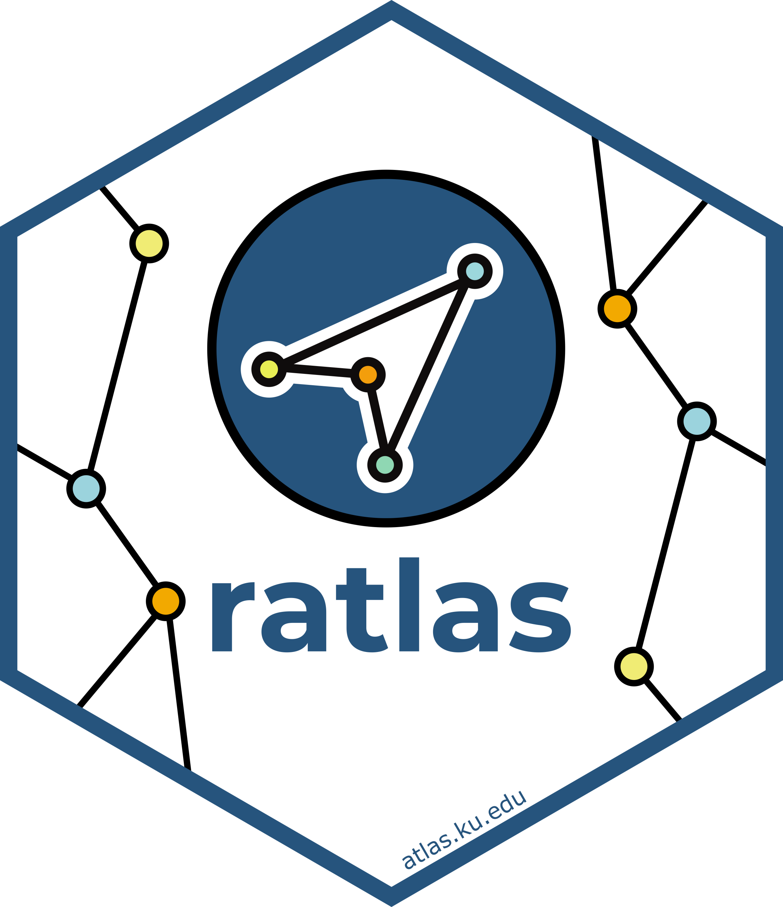

```{r echo=FALSE, out.width="20%", fig.align="center"}

```

> **Note:** `ratlas` was recently archived on CRAN due to a dependency being
> removed. We're actively working to get it back, but these submission lessons
> still apply!

Submitting `ratlas` to CRAN was one of those experiences that makes you a better
R developer. There's a lot of
back-and-forth, and each round of feedback teaches you something new about
writing clean, considerate package code. Here are the lessons that stuck with me.

---

## 1. Start with `usethis::use_release_issue()`

This function sets up a structured checklist that guides you through the release
process, and it's the best place to start. It will prompt you to choose a version
type:

- **Major** — A significant change that would be expected to break users' code. Reserved for significant redesigns.
- **Minor** — A minor version update means that new functionality has been added to the package. It might include new functions or improvements to existing functions that are compatible with most existing code.
- **Patch** — Patch updates are bug fixes. They solve existing issues but don’t do anything new.

For an initial release, `0.1.0` is the standard starting point.

---

## 2. Every exported function needs `@return` and `@examples`

CRAN wants clear and comprehensive documentation, no exceptions. Every exported function
needs a `@return` tag, even if it doesn't return anything! For example, `set_theme()` is a function in my package that doesn’t return anything, so I made sure to specify `'None'` in the documentation and included examples of usage. 

---

## 3. Package anchors in Rd files

CRAN flagged missing anchors in my Rd files early on. The rule: if you're
linking to a function that isn't in your package or base R, you need to specify
the package. So instead of just `discrete_scale()`, it should be
`ggplot2::discrete_scale()`. A small thing, but CRAN is strict about it.

---

## 4. Watch out for line breaks, file paths, and `par()` changes

A few environment-related issues came up together:

- A stray line break in an Rd file caused an error in `only_if()`
- Writing to a user's home directory isn't allowed. Use `tempdir()` as the
  default for any temporary files (I fixed this in `ggsave2()`)
- If your examples change `par()` settings, reset them afterward so they don't
  affect the user's environment

---

## 5. No shop links in documentation

CRAN does not allow links to online stores, such as Amazon. I had originally included a link to the ggplot2 book on Amazon in a vignette, which CRAN flagged. I fixed this
issue by including a link to the publisher's page instead.

---

## 6. Don't use `if(FALSE){}` and `@examplesIf` in your examples

I had been using `@examplesIf` (which compiles to `if(FALSE){}`) to skip examples
that depended on missing packages. CRAN recommends these preferred
alternatives:

- `\dontrun{}` — for examples that would genuinely error
- `\donttest{}` — for examples that are long-running or environment-dependent

---

## 7. But don't overuse `\dontrun{}` either

CRAN pushes back on `\dontrun{}` if it seems unnecessary. Their preference is
that examples actually run, so if `\donttest{}` is sufficient, use that. For
functions like `ggsave2()`, I had to either justify `\dontrun{}` or switch to
`\donttest{}`. The takeaway: CRAN takes running examples very seriously!

---

The CRAN review process is thorough by design, which is what makes the repository
trustworthy. If you're preparing your own submission, `usethis::use_release_issue()`
and `devtools::check()` will catch a lot before you submit. While the process does come with a learning curve, 
it ultimately pushes you to write cleaner, more reliable code, create thorough documentation, and think carefully about how your work will perform in different user environments. 

Hopefully these reflections make the process a bit smoother for others preparing to take it on, and when CRAN
does come back with notes, treat each one as a specific, fixable improvement that will strengthen your package not just for yourself, but for the entire community.
